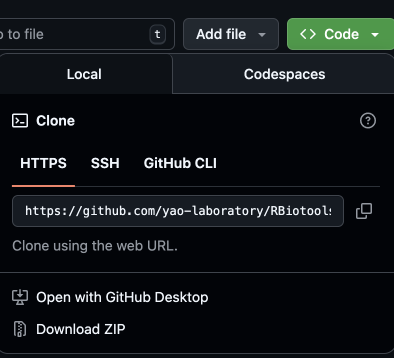
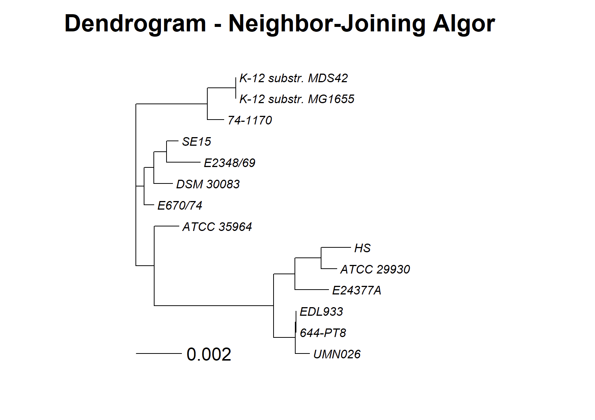
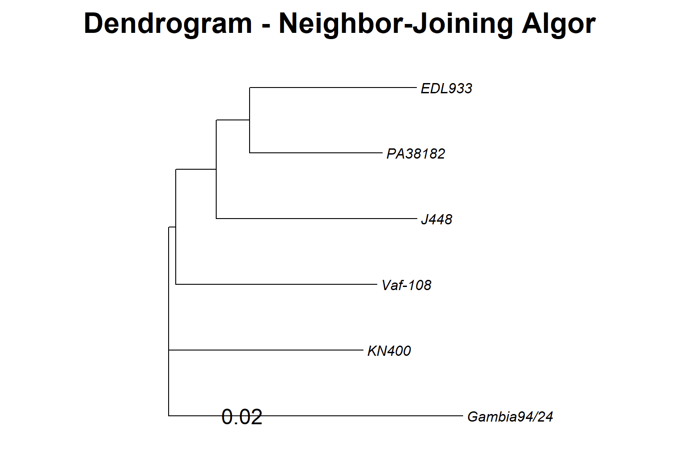
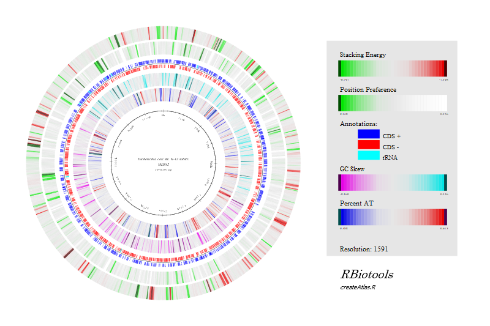
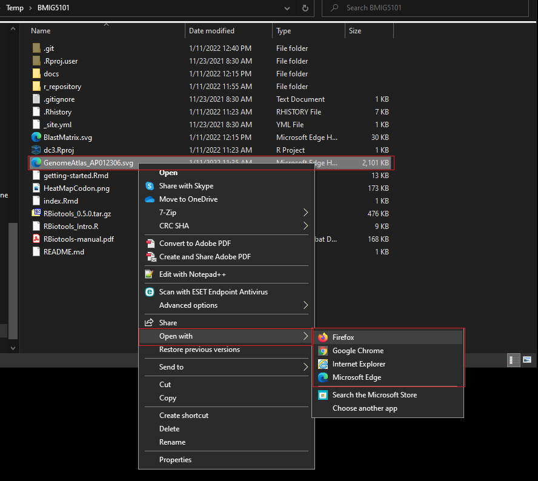
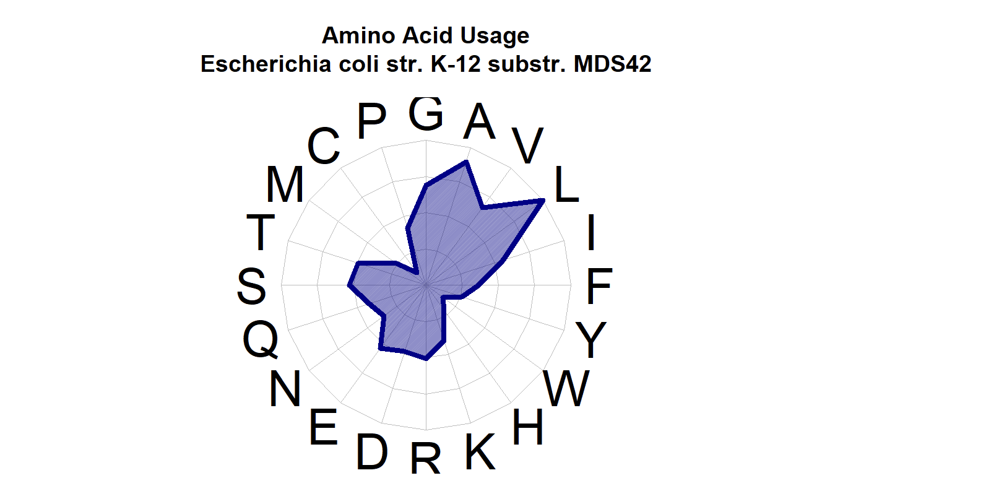
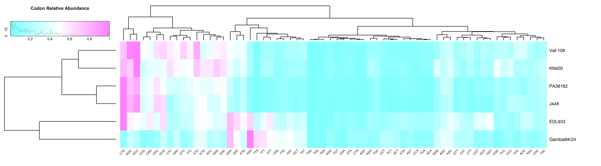
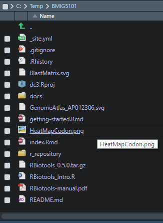

RBioTools facilitates comparative microbial genomics analyses directly in RStudio. By utilizing standard GenBank IDs, the package automates data retrieval and simplifies the creation of genomic figures.

## Section 1: Prerequisites & Installation

To get started, please complete the following installations in order.

### 1. Install R and RStudio
You need both the programming language (R) and the interface (RStudio).

* **Step A:** Download and install **R** from [The R Project](https://cran.r-project.org/).
* **Step B:** Download and install **RStudio Desktop** from [Posit](https://posit.co/download/rstudio-desktop/).

> **Note:** Ensure you download the correct versions for your specific operating system (Windows, macOS, or Linux).

### 2. Install Build Tools
You need specific tools to compile R packages from source. **Select your operating system below:**

::: {.panel-tabset}

## Windows Users
**Install Rtools**

You must install **Rtools** to build packages on Windows.

1.  Download **Rtools42** (or the latest version compatible with your R version) from [CRAN Rtools](https://cran.r-project.org/bin/windows/Rtools/rtools42/rtools.html).

2.  Run the installer and follow the default instructions.

## Mac Users
**Install Xcode Command Line Tools**

You need Xcode tools to compile packages on macOS.

1.  Open your **Terminal** (Press `Cmd + Space`, type "Terminal", and hit Enter).

2.  Copy and paste the following command, then press Enter:
    ```xcode-select --install
    ```
3.  A pop-up window will appear asking for confirmation. Click **Install** and wait for the process to finish.
:::

### 3. Setup Your Workspace
Designate a specific folder on your computer to act as your **Working Directory**.

::: {.callout-tip}
## Suggestion
Create a folder named `RBiotools` in your Documents folder. Keep all your scripts and data here to avoid "File Not Found" errors later.
:::

### 4. Download Workshop Files
Download the entire repository as a ZIP file.

1.  **Go to the GitHub Repository:** [Click here to open the repository](https://github.com/yao-laboratory/RBiotools).
2.  **Find the "Code" Button:** Look for the green **<> Code** button near the top-right of the file list.
3.  **Download ZIP:** Click the button and select **Download ZIP** from the dropdown menu.
4.  **Extract the Files:**
    * Locate the downloaded `.zip` file on your computer.
    * Right-click and select **Extract All** (Windows) or double-click it (Mac).
    * Move the extracted folder to your **Working Directory** (e.g., `Documents/RBiotools`).



### 5. Launch & Verify

1.  Open **RStudio**.
2.  Go to **File** $\rightarrow$ **Open File...** and select your `getting-started.R` script.
3.  **Check your R Version:**

    Run the command below in your Console to ensure you are using a compatible version of R.

    ```{r}
    #| eval: false
    sessionInfo()
    ```

> **Compatibility Note:** These instructions were tested with **R version 4.5.2 (2025-10-31)**. Older versions may behave differently.

# Section 2: Install Packages and RBioTools
> **Note:** Use the copy icon (clipboard) in the top-right of the code blocks to easily copy commands.

### 1. Install Dependencies
Run the following code to install the basic dependencies required for `RBioTools`. You only need to run this step **once** (the first time you set up R).

```{r}
#| eval: false

# 1. Install RMarkdown dependencies
install.packages("rmarkdown")

# 2. Install RBioTools dependencies
# These packages are not included in standard R installations
required_packages <- c("ape", "data.table", "fmsb", "ggplot2", "gplots", 
                       "grImport", "gridExtra", "pheatmap", "rentrez", 
                       "seqinr", "RCurl")

install.packages(required_packages)
```

### 2. Install BioConductor Packages
Install `msa` and `pwalign` using the BiocManager.
```{r}
#| eval: false

# 1. Install BiocManager if missing
if (!requireNamespace("BiocManager", quietly = TRUE))
    install.packages("BiocManager")

# 2. Install msa and pwalign
BiocManager::install(c("msa", "pwalign"), force = TRUE)
```

::: {.callout-note}
## Troubleshooting msa
If the msa installation fails with a "non-zero exit status" error, try installing the development version directly from GitHub: https://github.com/UBod/msa 
:::

### 3. Install Helper Tools (Windows Only)
If you are on Windows, you may need the `installr` package to handle specific installation tasks. **Mac/Linux users can skip this step**.
```{r}
#| eval: false

install.packages("installr", repos ="http://cran.us.r-project.org")
```

### 4. Load Libraries
```{r}
#| eval: false

library(msa)
library(installr)
```

::: {.callout-tip}
## Common Warning
You may see a warning message stating: "package(s) not installed when version(s) same as or greater than current". You can safely ignore this. 
:::

### 5. Set the Working Directory
You must tell R where your files are located. Use the code tab below that matches your operating system.

::: {.panel-tabset}

## Windows

Replace `YourName` with your actual username.
```{r}
#| eval: false

# Example Windows Path
setwd("C:/Users/YourName/Documents/RBiotools/")
```

## Mac

Replace `YourName` with your actual username.
```{r}
#| eval: false

# Example Mac Path
setwd("/Users/YourName/Documents/RBiotools/")
```
:::

### 6. Install RBioTools

Install the package from the local source file.

> **Important:** Ensure the file RBiotools_0.5.7.tar.gz is inside the Working Directory you set in Step 5.
```{r}
#| eval: false

install.packages("RBiotools_0.5.7.tar.gz", repos = NULL, type = "source")
```

### 7. Final Check

Load the library to verify installation was successful.
```{r}
#| eval: false

library(RBiotools)
```

# Section 3: Identify the Organisms

The first step is to choose the set of organisms you wish to analyze.

**What is an "Organism" in RBioTools?**

In this package, an organism is defined by its identifier:

* **GenBank Accession IDs:** Most organisms are specified using their unique ID from [GenBank](https://www.ncbi.nlm.nih.gov/genbank/).
* **Custom Genomes:** Organisms **not** in GenBank can be added manually using the `addGenome()` function.

## 3.1 Create a List of Organisms

To get started, we will define a sample set of *E. coli* organisms.

### 1. Define the *E. coli* List

Create a list of *E. coli* organisms and store them in an object named `eColi`.

```{r, eval=FALSE}
eColi <- c(
  "AP012306",  # Escherichia coli str. K-12 substr. MDS42 DNA         3.976 Mb - smallest chromosome
  "KK583188",  # Escherichia coli DSM 30083 = JCM 1649 = ATCC 11775   4.907 Mb - type strain scaffold
  "U00096",    # Escherichia coli str. K-12 substr. MG1655            4.642 Mb - first E. coli genome sequenced
  "CP000802",  # Escherichia coli HS                                  4.644 Mb - group A representative, commensal
  "CP000800",  # Escherichia coli E24377A                             4.980 Mb - group B1 representative
  "AP009378",  # Escherichia coli SE15                                4.717 Mb - group B2 representative, commensal
  "FM180568",  # Escherichia coli 0127:H6 E2348/69                    4.966 Mb - group B2 representative, enteropathogenic
  "CU928163",  # Escherichia coli UMN026                              5.202 Mb - group D representative
  "CP008957",  # Escherichia coli O157:H7 str. EDL933                 5.547 Mp - group E representative
  "CP027027",  # Shigella dysenteriae strain E670/74                  5.037 Mb - Shigella dysenteria representative
  "CP026802",  # Shigella sonnei strain ATCC 29930                    4.975 Mb - Shigella sonnei representative
  "CP026877",  # Shigella boydii strain ATCC 35964                    5.129 Mb - Shigella boydii representative
  "CP026793",  # Shigella flexneri strain 74-1170                     4.734 Mb - Shigella flexneri representative
  "CP015831"   # Escherichia coli O157 strain 644-PT8                 5.831 Mb - largest chromosome
) 
```

### 2. Define the Proteobacteria List

Create a list of Proteobacteria organisms and store it in the variable `proteobacteria`.

```{r, eval=FALSE}
proteobacteria <- c(
  "CP018228", # Rhizobium leguminosarum strain Vaf-108              Phylum: Proteobacteria (alpha)
  "CP017405", # Bordetella pertussis strain J448                    Phylum: Proteobacteria (beta)
  "CP008957", # Escherichia coli O157:H7 str. EDL933                Phylum: Proteobacteria (gamma)
  "HG530068", # Pseudomonas aeruginosa PA38182                      Phylum: Proteobacteria (gamma)
  "CP002031", # Geobacter sulfurreducens KN400                      Phylum: Proteobacteria (delta)
  "CP002332"  # Helicobacter pylori Gambia94/24                     Phylum: Proteobacteria (epsilon)
)
```

## 3.2 Verify and Download Data

With your sample list ready, run `downloadGenBank()` to generate a data frame containing the biological details for each organism.

###  Checking the *E. coli* List
```{r, eval=FALSE}
downloadGenBank(eColi)
```

.png)

### Checking the Proteobacteria List
```{r, eval=FALSE}
downloadGenBank(proteobacteria)
```

.png)

# Section 4: Explore functions that make plots and figures

## 4.1 Dendrograms

Generating a dendrogram from 16S rRNA genes is a straightforward process, though runtime varies based on the dataset size.

::: {.callout-note}
## Runtime Notice
Fetching data from GenBank may take several minutes. The `proteobacteria` list is shorter than the `eColi` list and will process much faster.
:::

### Dendrogram for *E. coli*
```{r, eval=FALSE}
# This first plot is for the eColi and Shigella organisms
dendrogram16S(eColi)
```

.png)



### Dendrogram for Proteobacteria
```{r, eval=FALSE}
# The second plot is for the proteobacteria organisms
dendrogram16S(proteobacteria)
```

.png)



## 4.2 Genome Atlas

To create a genome atlas for a specific organism from an existing list (like `eColi` or `proteobacteria`), simply select it using its index.

```{r, eval=FALSE}
# Select the first item (AP012306) using list indexing
createAtlas(eColi[[1]])
```

.png)



::: {.callout-tip}

## To view the file

The graphic generated in this step is saved as an SVG file in your working directory.

1. Open your computer's file browser (Explorer/Finder).
2. Navigate to your working directory.
3. Right-click the SVG file and select **Open with**.
4. Choose a web browser (e.g., Chrome, Firefox, Safari) to view the image.
:::



### Analyze a Single Organism

If you need to analyze an organism not currently in your list, simply locate its accession ID on GenBank and pass it directly to the function as shown below.

```{r, eval=FALSE}
# Manually input a GenBank Accession ID
createAtlas("AP012306")
```

## 4.3 Amino Acid Usage Plot

The `plotUsage` function offers extensive customization options. Check the documentation to explore the full range of parameters.

```{r, eval=FALSE}
plotUsage(eColi[1])
```

.png)



## 4.4 Codon Heat Map

Heat maps are most informative when analyzing **distantly related** organisms, such as our Proteobacteria group.

```{r, eval=FALSE}
plotHeatMapCodon(proteobacteria)
```

.png)



::: {.callout-tip}

## How to view the PNG in RStudio

The graphic generated in this step is automatically saved as a PNG file.

1. Open the **Files** tab in RStudio (usually in the bottom-right pane).
2. Navigate to your working directory. *(Tip: You may need to click the **Refresh** button if the file doesn't appear immediately.)*
3. Click on `HeatMapCodon.png` to open it.
:::



## 4.5 Blast Matrix

BLAST matrices function best with groups of **closely related** organisms (e.g., *E. coli*).

To generate this visualization, we first build a **Homology Matrix** using `runLinclust()` and then plot it.

```{r, eval=FALSE}

# 1. Build the homology matrix (protein grouping)
proteinGrouping <- runLinclust(eColi)

# 2. Plot the BLAST matrix
plotBlastMatrix(proteinGrouping)
```


::: {.callout-tip}

## How to view the SVG file

This output is saved as an SVG file.

1. Navigate to your working directory in your computer's file browser.
2. Right-click the file and select **Open with → Web Browser**. 
:::

### Understanding the Homology Matrix

The `proteinGrouping` object created by `runLinclust` is a table organized as follows:

* Rows: Represent the different protein groups.
* Columns: Represent the individual organisms.
* Values: Represent the number of proteins an organism contributes to that group.